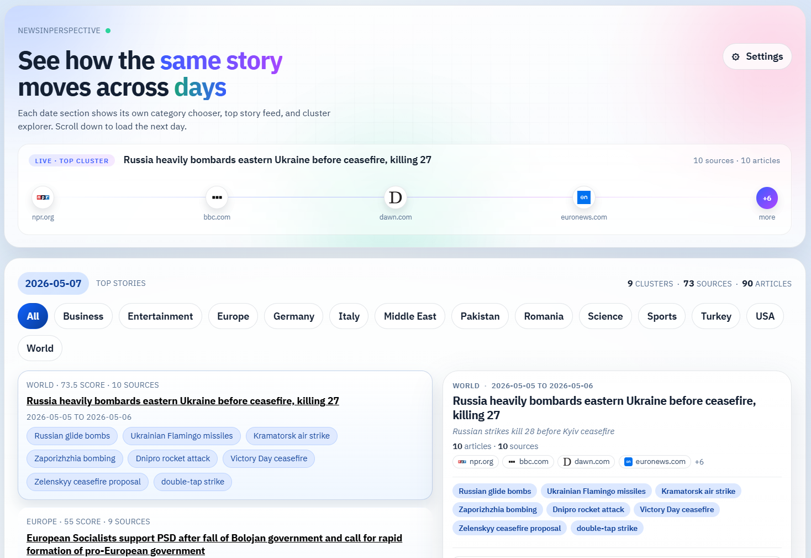

# News In Perspective



Monorepo for a news-comparison project that ingests RSS feeds from Kagi's public `kite_feeds.json` catalog, stores normalized article data in Postgres, clusters same-day coverage, and exposes lightweight NLP comparison signals to a Svelte frontend.

## Contents
- [About this project](#about-this-project)
- [Workspace](#workspace)
- [Local setup](#local-setup)
  - [Prerequisites](#prerequisites)
  - [Steps](#steps)
  - [Defaults & ports](#defaults--ports)
  - [Configuration notes](#configuration-notes)
  - [Troubleshooting](#troubleshooting)
- [Ingestion](#ingestion)
- [Daily pipeline](#daily-pipeline)
  - [Single-command pipeline run](#single-command-pipeline-run)
  - [Cluster selection knobs (kagi-ingest)](#cluster-selection-knobs-kagi-ingest)
  - [Article enrichment & framing summary](#article-enrichment--framing-summary)
- [Sidecar services](#sidecar-services)
  - [Perspective sidecar](#perspective-sidecar)
  - [NER sidecar](#ner-sidecar)
- [API endpoints](#api-endpoints)
- [Validation](#validation)
- [Notebook workflow](#notebook-workflow)

## About this project

This is an NLP experiment for the [UTS Applied Natural Language Processing (36118)](https://coursehandbook.uts.edu.au/subject/2026/36118) class, Autumn 2026.

Repository: https://github.com/coezbek/newsinperspective

### Subject coordinator & teachers
- [Dr Arnick Abdollahi](https://www.linkedin.com/in/arnick-abdollahi-28416b80/) (subject coordinator) — [UTS profile](https://profiles.uts.edu.au/Arnick.Abdollahi)
- [Mutaz Abu Ghazaleh](https://www.linkedin.com/in/mutazag/) (teacher, Founder of MAGTech.ai)
- [Sarah Fawcett](https://www.linkedin.com/in/sarah-fawcett-6b120114a/) (teacher)

### Authors
- [Christopher Oezbek](https://www.linkedin.com/in/coezbek/)
- Raul Perez Garcia
- [Siqi Zhang](https://www.linkedin.com/in/siqi-zhang-a785b334b/)
- Myeongjin Han
- Andrew Fenelon

### Data & key technologies
- News data from [Kagi News (Kite)](https://kite.kagi.com/)
- [Svelte](https://svelte.dev/) + [Vite](https://vitejs.dev/) frontend
- [Node.js](https://nodejs.org/) + [Fastify](https://fastify.dev/) + [TypeScript](https://www.typescriptlang.org/) API
- [Prisma](https://www.prisma.io/) ORM with [PostgreSQL](https://www.postgresql.org/)
- [OpenRouter](https://openrouter.ai/) for LLM-based keyword and entity enrichment
- Named entity recognition (spaCy) and entity linking against [Wikipedia](https://en.wikipedia.org/)

## Workspace
- `apps/api`: Fastify API plus ingestion jobs
- `apps/web`: Svelte + Vite frontend
- `apps/perspective`: Python FastAPI sidecar for SBERT framing-divergence + RoBERTa sentiment + TF-IDF
- `apps/ner`: Python FastAPI sidecar for spaCy `en_core_web_lg` named-entity recognition
- `packages/db`: Prisma schema and generated client
- `packages/shared`: shared DTOs and schemas

## Local setup

### Prerequisites
Linux/macOS, with:
- `git`
- `nvm`
- Docker + Docker Compose
- Python 3.12+ (for notebooks)
- `uv` (for notebook workflow)

### Steps
1. Select and install the repo Node version: `nvm install && nvm use`
2. Enable Corepack and install the pinned package manager: `corepack enable && corepack install`
3. Create env file: `cp .env.example .env`
4. Install dependencies: `pnpm install`
5. Start Postgres: `pnpm db:start`
6. Generate Prisma client: `pnpm db:generate`
7. Run migrations: `pnpm db:migrate`
8. Start the backend in dev mode (terminal 1): `pnpm --filter @news/api dev`
9. Start the frontend (terminal 2): `pnpm web:start`

`package.json` pins `pnpm@10.32.1`, so once Corepack is enabled it will provision the correct `pnpm` version for this repo. If `nvm` is not already installed on your machine, install it first and then run `nvm use`.

### Defaults & ports
- API: `http://localhost:4400`
- Frontend: `http://localhost:5317`
- Postgres: `localhost:55432`

### Configuration notes
- Logical run dates default to `UTC` via `APP_DATE_TIMEZONE`; stored timestamps remain UTC instants in Postgres.
- For the first few runs, the default `.env` sets `INGEST_FEED_LIMIT=50` so ingestion completes quickly while you validate the pipeline. Remove or increase that limit once you are ready for broader collection.
- If OpenRouter free models are hot, adjust `OPENROUTER_MODEL_OFFSET` or provide a broader comma-separated `OPENROUTER_MODEL` list.

### Troubleshooting
- If `pnpm db:start` fails with a Docker container-name conflict, you already have an existing `news-in-perspective-postgres` container from another checkout. Reuse that container or stop/remove it before retrying.

## Ingestion

The current ingestion path is the cluster-based Kagi News pipeline
(`pnpm kagi:ingest` → `src/scripts/kagi-ingest.ts`). It pulls cluster
snapshots from Kagi News and extracts article bodies via a headless
browser. The original RSS-catalog ingestion has been retired from
`package.json`; see [LEGACY.md](./LEGACY.md) for historical context.

`pnpm kagi:ingest` runs only stage 1 of the daily flow. For a complete
daily run (ingest + LLM enrichment + entities + perspective +
calibration in one process), use `pnpm pipeline:run` — see the
[Daily pipeline](#daily-pipeline) section below.

For long-running Kagi ingests, prefer a persistent `tmux` session with a log file so progress survives terminal disconnects:

```bash
mkdir -p logs
tmux new-session -d -s kagi_ingest \
  "cd /home/coezbek/2026/NewsInPerspectiveCodex && pnpm kagi:ingest 2>&1 | tee logs/kagi-ingest-$(date -u +%Y%m%dT%H%M%SZ).log"

# Watch live:
tmux attach -t kagi_ingest          # detach with Ctrl+b d
tail -f logs/kagi-ingest-*.log

# Check whether it is still running:
tmux ls
```

Enrich publisher article text for notebook analysis:

```bash
pnpm enrich:text 2026-03-23 100
```

This fetches publisher pages for up to `100` articles on that date, extracts readable body text where possible, and stores it on the article record for export.

Inspect text-enrichment status:

```bash
pnpm enrich:status 2026-03-23
```

Run a small verification sample:

```bash
pnpm verify:text-enrichment 2026-03-23 3
```

Runtime logs are written to `logs/`, including:

- `logs/api.log`
- `logs/pipeline-*.log` (one per pipeline stage, see `pnpm pipeline:run`)

## Daily pipeline

Each daily run is a chain of five jobs, executed strictly serially by the
pipeline runner (`apps/api/src/services/pipeline-runner.ts`). The scheduler
(`apps/api/src/workers/scheduler.ts`) enqueues them in order when
`AUTO_INGEST=true`, and the same chain can be reproduced manually:

| Stage | Job kind | Script | Produces |
| --- | --- | --- | --- |
| 1 | `kagi-ingest` | `src/scripts/kagi-ingest.ts` | `Article.fullText`, `StoryCluster`, `ClusterArticle`, plus a best-effort `ClusterPerspective` row per cluster |
| 2 | `openrouter-backlog` | `src/scripts/enrich-openrouter.ts` | `Article.translatedFullText`, `Article.language`, summary, cluster keywords |
| 3 | `entity-re-enrich` | `src/scripts/entity-re-enrich.ts` | `NamedEntity`, `EntityMention` (spaCy NER + Wikipedia link inline) |
| 4 | `cluster-perspective-backfill` | `src/scripts/cluster-perspective-backfill.ts` | Cluster perspective metrics |
| 5 | `perspective-calibrate` | `src/scripts/perspective-calibrate.ts` | Refreshed divergence-score quantiles (when calibration TTL expired) |

Stage 3 reads `translatedFullText` for non-English articles (falling back to
`fullText` if translation hasn't run), so stage 2 must complete before stage 3.
Wikipedia linking is **not** a separate stage; it runs inline per emitted
spaCy entity inside `enrichArticleWithEntities`.

Running `pnpm kagi:ingest` on its own only completes **stage 1**. It runs an
inline best-effort `computeClusterPerspective` per cluster, but leaves
keywords as `keywords_pending` and emits no translations, entities,
narratives, or recalibration. To get a full daily slice you need to run
stages 2–5 too. LLM narrative generation (`perspective-narrative`) and
the LLM country resolver (`perspective-resolve-countries`) are
**explicit, out-of-band** batch scripts and are intentionally not part
of the chain.

### Single-command pipeline run

The canonical chain is wrapped by `pnpm pipeline:run`
(`src/scripts/pipeline-run.ts`). One process runs all five stages
serially, mirrors each stage's output to `logs/pipeline-<n>-<name>.log`,
loops the OpenRouter enrichment until the article backlog drains, and
prints a token-usage summary at the end.

```bash
# Default: today (UTC), 10 clusters x <=10 articles per cluster.
pnpm pipeline:run

# Explicit options:
pnpm pipeline:run --date=2026-05-07 --clusters=10 --articles-per-cluster=10

# With paid OpenRouter fallback enabled (used only after the free pool fails):
OPENROUTER_PAID_FALLBACK_MODEL=deepseek/deepseek-chat \
  pnpm pipeline:run
```

For long runs, wrap the command in `tmux` so it survives disconnects:

```bash
tmux new-session -d -s pipeline "pnpm pipeline:run 2>&1 | tee logs/pipeline-run.log"
tmux attach -t pipeline   # detach with Ctrl+b d
```

If a stage fails the runner stops and exits non-zero; rerun
`pnpm pipeline:run` to resume — earlier stages are idempotent
(`KAGI_INGEST_SKIP_EXISTING=false` is set so a re-run refreshes article
bodies for the same date).

### Cluster selection knobs (kagi-ingest)

`pnpm --filter @news/api exec tsx src/scripts/kagi-ingest.ts <globalLimit> <perCategoryLimit>`

- `globalLimit` (argv[2]) — top-N clusters by source count picked from the
  whole snapshot.
- `perCategoryLimit` (argv[3]) — top-N **additional** clusters from each of
  the seven required categories (World, USA, Business, Technology, Sports,
  Science, Gaming). The two sets are unioned and deduplicated.

To select **exactly** N clusters, pass `<N> 0`. Example: `10 0` picks the
global top 10 and skips the per-category top-up.

- `KAGI_INGEST_MAX_SOURCES_PER_CLUSTER` — hard cap on sources extracted per
  cluster. Applied **before** browser extraction, so unused sources cost
  nothing.
- `KAGI_INGEST_SKIP_EXISTING` (default `true`) — set to `false` to re-extract
  clusters already imported for the same `storyDate`.

### Article enrichment & framing summary

`apps/api/src/services/openrouter-article-enrichment.ts` calls an OpenRouter
free-tier model per article and produces five text fields:

- `translatedTitle` / `translatedSummary` — short English versions for display.
- `translatedFullText` — the chrome-stripped, English-translated body. Used
  by the UI (article view, story-detail panel). Capped on input at 25K chars
  before the LLM call; bounded on output by `ENRICHMENT_MAX_OUTPUT_TOKENS`
  (4096) — both truncations are flagged on the result.
- **`framingSummary`** — an abstractive 4-6 sentence summary written
  specifically to capture *what makes this source's framing distinctive*
  (stance, emphasis, attribution patterns). This is the field SBERT embeds
  for the cluster framing-divergence score; the full body is no longer the
  primary embedding input.
- `keywords` / `persons` / `organizations` / `places` — entity lists.

Why a separate `framingSummary` instead of just embedding `translatedFullText`:

- **Output-token caps no longer corrupt the divergence signal.** Free models
  often default to 1024-2048 output tokens — long enough to truncate
  `translatedFullText` mid-sentence on real articles. SBERT then embeds the
  truncated body, polluting the score. `framingSummary` is short by design.
- **Higher signal-to-noise.** Wire-service stories share verbatim quotes
  across many outlets; embedding those drags every source's vector toward
  the same centroid. The summary is asked to *exclude* shared content and
  keep what each outlet does differently.

The result also carries two truncation flags downstream consumers can use:

- `inputTruncated` — `true` when the original body exceeded
  `TRANSLATED_FULL_TEXT_MAX_CHARS` and we sliced before sending. Always known.
- `bodyAppearsTruncated` — the model's own assessment of whether the body
  it received looked cut off. `null` when the model omitted the field.

When SBERT input is selected (`cluster-perspective.ts:pickArticleText`),
preference order is: `framingSummary` → `translatedFullText` → raw English
`fullText`. Older articles without `framingSummary` still work via the
fallback; running `pnpm entity:re-enrich --force` repopulates them.

## Sidecar services

### Perspective sidecar

`apps/perspective/` is a FastAPI service that computes the cluster framing-divergence
score (SBERT `all-mpnet-base-v2`), per-source distinctive words (TF-IDF), and
per-country sentiment (`cardiffnlp/twitter-roberta-base-sentiment-latest`).
It is **not** in `docker-compose.yml`; start it locally with `uv`:

```bash
cd apps/perspective
uv venv
uv pip install -e .
uv run python app.py
```

It listens on `127.0.0.1:5710` by default (`PERSPECTIVE_HOST` / `PERSPECTIVE_PORT`
to override). First request cold-loads ~1 GB of models; `POST /warmup` preloads
them. Stage 4 of the pipeline (`cluster-perspective-backfill`) calls this service
— without it, divergence scores and distinctive words are not produced.

See `apps/perspective/README.md` for the full API and config surface.

### NER sidecar

`apps/ner/` is a FastAPI service running spaCy `en_core_web_lg`. Bring it up
alongside Postgres:

```bash
docker compose up -d ner
curl http://127.0.0.1:5711/health
```

`apps/api/src/services/entity-recognition.ts` is a thin client that maps
spaCy labels to `EntityType` (`PERSON/ORG/GPE/EVENT`; `LOC→GPE`; `DATE`
dropped). Configure with `NER_SERVICE_URL` and `NER_SERVICE_TIMEOUT_MS`.

## API endpoints

Date and story browsing:

- `GET /api/dates`
- `GET /api/stories?date=2026-03-23`
- `GET /api/stories/:id`
- `GET /api/stories/:id/comparison`

Cluster/domain entity views — once stage 3 has populated
`EntityMention`, these surface the "framing differences across outlets"
data the notebook explored:

- `GET /api/clusters/:clusterId/entities` — top entities in a cluster.
- `GET /api/clusters/:clusterId/entities/by-domain` — same, grouped by
  source domain.
- `GET /api/domains/:domain/entities` — top entities for a single source
  across the corpus.

## Validation
- `pnpm lint`
- `pnpm test`
- `pnpm build`

## Notebook workflow

For team NLP analysis in Jupyter, use the shared notebook workspace under `notebooks/`.

1. Create the Python environment with `uv venv`
2. Activate it with `source .venv/bin/activate`
3. Install notebook tooling with `uv sync && uv pip install -r notebooks/requirements.txt`
4. Export a date slice from the running API:

```bash
pnpm export:notebook -- \
  --date 2026-03-23 \
  --api-base http://localhost:4400 \
  --output-dir notebooks/exports/2026-03-23
```

5. Convert the Jupytext template if needed: `source .venv/bin/activate && jupytext --to ipynb notebooks/templates/nlp_analysis.py`
6. Open the notebook and point `EXPORT_DIR` at the exported slice.

The exporter writes flat JSONL files that load directly into pandas dataframes and work well for shared notebook analysis.
Activate `.venv` before running notebook or Drive-sync commands, since `pnpm drive:push` rebuilds the shared `.ipynb`.
