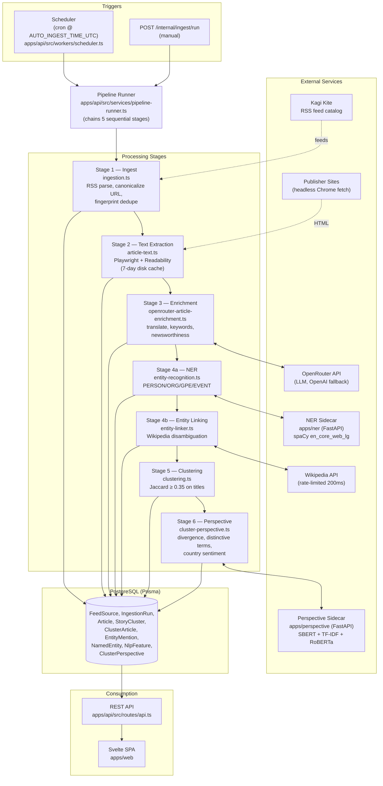

# Ingestion Pipeline — System Architecture

## Overview

The ingestion pipeline turns raw RSS feeds into clustered, entity-annotated, perspective-scored stories served to the Svelte web frontend. It is orchestrated by a daily scheduler that enqueues a chained, multi-stage job through `pipeline-runner.ts`.

## High-Level Diagram

## Component Responsibilities

### Triggers
- **Scheduler** (`apps/api/src/workers/scheduler.ts`) — fires once per day at `AUTO_INGEST_TIME_UTC`.
- **Internal API** (`POST /internal/ingest/run`) — manual on-demand trigger.

### Orchestration
- **Pipeline Runner** (`apps/api/src/services/pipeline-runner.ts`) — enqueues and chains the stages: `kagi-ingest → openrouter-backlog → entity-re-enrich → cluster-perspective-backfill → perspective-calibrate`. Each stage records progress on the `IngestionRun` row.

### Stage 1 — Ingest (`ingestion.ts` + `rss-ingest.ts`)
Fetches the Kagi Kite feed catalog, parses RSS/Atom, canonicalizes URLs, deduplicates against existing articles using a text fingerprint, and upserts new `Article` rows with `FeedSource` linkage.

### Stage 2 — Text Extraction (`article-text.ts`)
Uses Playwright (headless Chromium) to fetch each article, runs Mozilla Readability for body extraction, falls back to meta-tag heuristics, and assesses extraction quality. Results are cached on disk for 7 days.

### Stage 3 — LLM Enrichment (`openrouter-article-enrichment.ts`)
Single OpenRouter call per article for: newsworthiness gate, translation (non-English → English), keyword extraction. 8 s timeout with 5 s/15 s/60 s retry backoff and OpenAI fallback. Writes to `Article.translatedFullText` and `NlpFeature`.

### Stage 4a — NER (`entity-recognition.ts` ↔ `apps/ner/main.py`)
HTTP POST to a Python FastAPI sidecar running spaCy `en_core_web_lg`. Returns PERSON/ORG/GPE/EVENT mentions which are canonicalized and noise-filtered into `EntityMention`.

### Stage 4b — Entity Linking (`entity-linker.ts`)
For each canonical entity: Wikipedia search → disambiguation → page summary + thumbnail. Cached 7 days for hits, 100 days for misses, rate-limited to 200 ms between requests with up to 3 retries. Persists to `NamedEntity`.

### Stage 5 — Clustering (`clustering.ts`)
Groups articles into `StoryCluster`s using title-token Jaccard similarity (threshold 0.35), preserves per-article rank and similarity in `ClusterArticle`.

### Stage 6 — Perspective Analysis (`cluster-perspective.ts` ↔ `apps/perspective/app.py`)
HTTP POST to perspective sidecar (SBERT embeddings + TF-IDF + RoBERTa sentiment). Produces a divergence score, per-source distinctive terms, and country-level sentiment, stored in `ClusterPerspective`.

## Storage (`packages/db/prisma/schema.prisma`)

| Table | Purpose |
|---|---|
| `FeedSource` | RSS catalog metadata |
| `IngestionRun` | Per-day run status & metrics |
| `Article` | Canonical article + extracted/translated text |
| `StoryCluster` | Topic groupings per day/category |
| `ClusterArticle` | Article ↔ cluster with rank/similarity |
| `EntityMention` | Per-article entity occurrences |
| `NamedEntity` | Deduped entity with Wikipedia link |
| `NlpFeature` | Keywords, sentiment, bias, enrichment state |
| `ClusterPerspective` | Divergence, distinctive words, country sentiment |

## Frontend Path
The Svelte SPA in `apps/web` consumes REST endpoints in `apps/api/src/routes/api.ts`:
`GET /api/dates`, `/api/stories`, `/api/stories/:id`, `/api/clusters/:id/perspective`, `/api/articles/:id`, `/api/sources/:domain`, `/api/tags/:keyword`.

## External Dependencies Summary

| Service | Used by | Protocol |
|---|---|---|
| Kagi Kite | Stage 1 | HTTPS (RSS) |
| Publisher sites | Stage 2 | Headless Chromium |
| OpenRouter (+ OpenAI fallback) | Stage 3 | HTTPS JSON |
| spaCy NER sidecar | Stage 4a | HTTP (intra-host) |
| Wikipedia REST | Stage 4b | HTTPS JSON |
| Perspective sidecar | Stage 6 | HTTP (intra-host) |
| PostgreSQL | All stages + API | Prisma |
